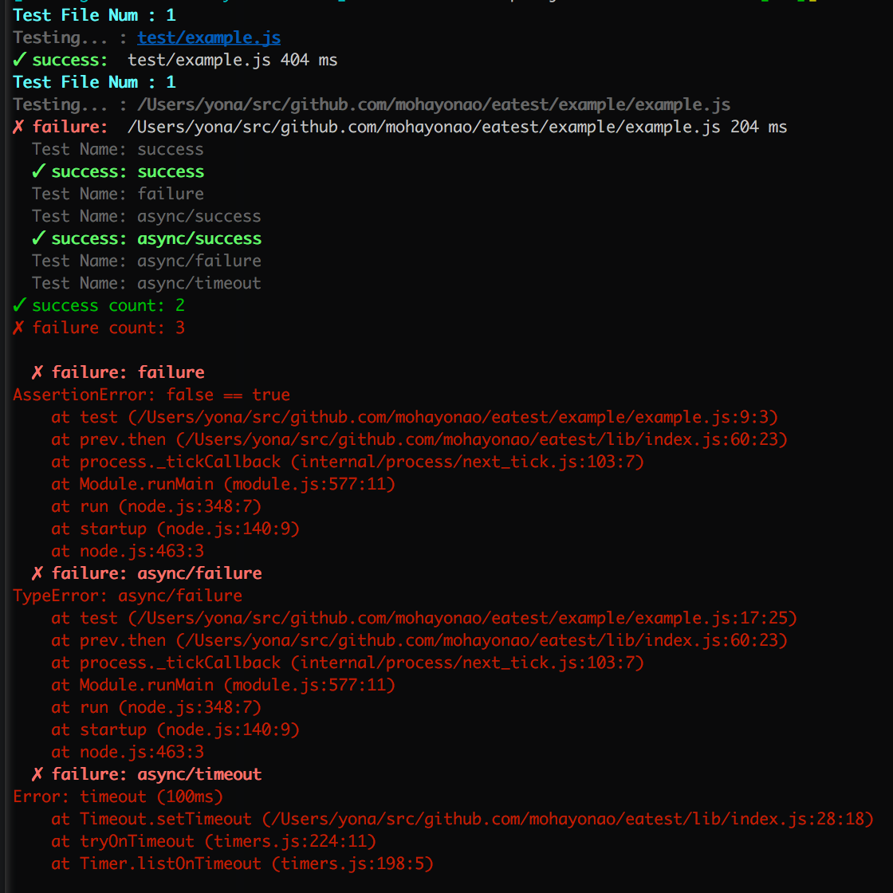

# eatest
[](https://travis-ci.org/mohayonao/eatest)
[](https://www.npmjs.org/package/eatest)
[](http://mohayonao.mit-license.org/)

test function for [eater](https://github.com/yosuke-furukawa/eater)

## Features

- can run a test file directly on the editor / [atom-runner](https://atom.io/packages/atom-runner)
- each subtests also run in a single process, so faster then `(eater/runner).test`

## How to use

### 1. Install

```
npm install -D eater eatest
```

### 2. Write tests

```js
// test/example.js
const assert = require("assert");
const test = require("eatest");

test("success", () => {
  assert(true);
});

test("failure", () => {
  assert(false);
});

test("async/success", () => {
  return Promise.resolve(true);
});

test("async/failure", () => {
  return Promise.reject(new TypeError("async/failure"));
});

test.timeout = 100; // default timeout is 2000ms
test("async/timeout", () => {
  return new Promise(() => { /* noop */ });
});
```

### 3. Run

```
$ eater test/example.js
```



## License

MIT
